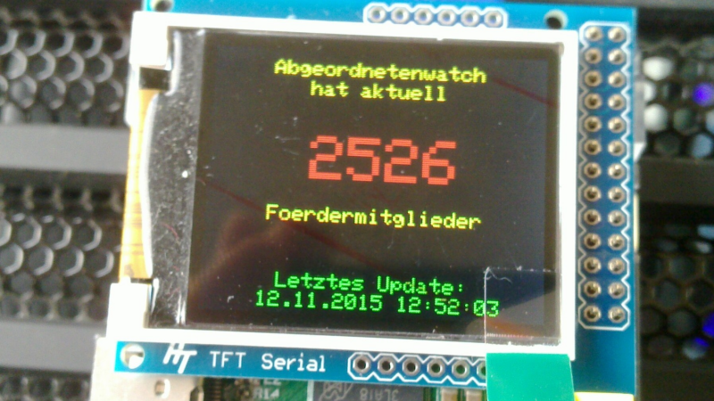

# serial-tft-parliamentwatch

display parliamentwatch number of supporters on serial tft display

### requires

 * serial display, try http://www.hobbytronics.co.uk/tft-serial-display-18
 * python2, python2-pyserial
 * python2-serialtft, try https://github.com/Gadgetoid/Serial-TFT-Python

### run

 * get an api for the supporter count of parliamentwatch, and setup `wget` or whatever
 * change all occurrences of `/path/to` to match your system setup
 * run it any time to update the screen (no looping or daemon included)
 
### credits

code is released under public domain using wtfpl v2.

written 2015 by @5chdn <schoedon@abgeordnetenwatch.de>

* https://github.com/5chdn/serial-tft-parliamentwatch/
* https://twitter.com/5chdn/
